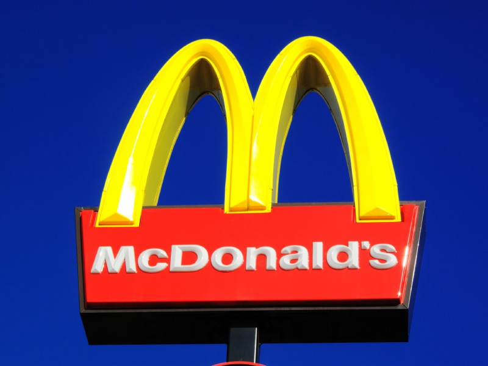
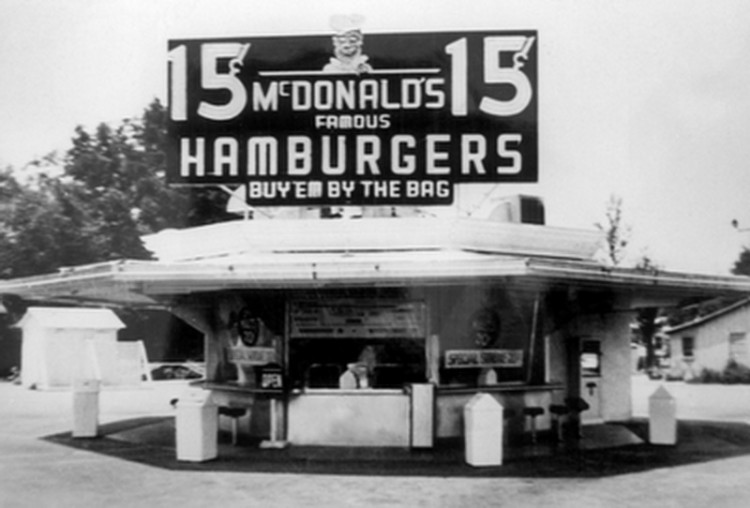
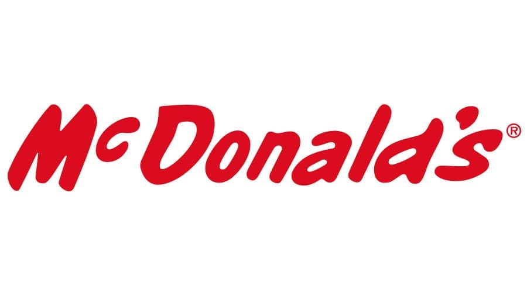
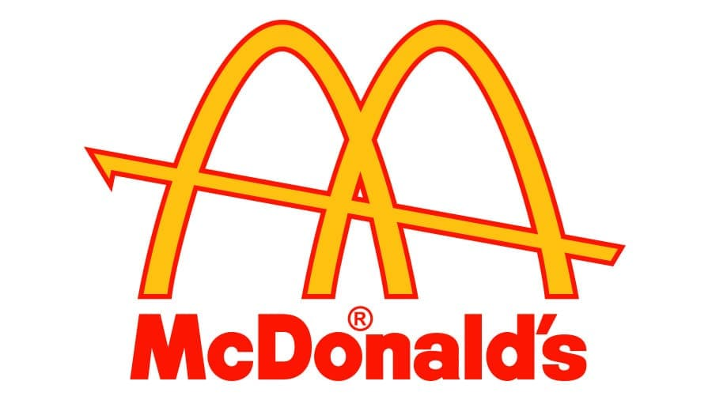
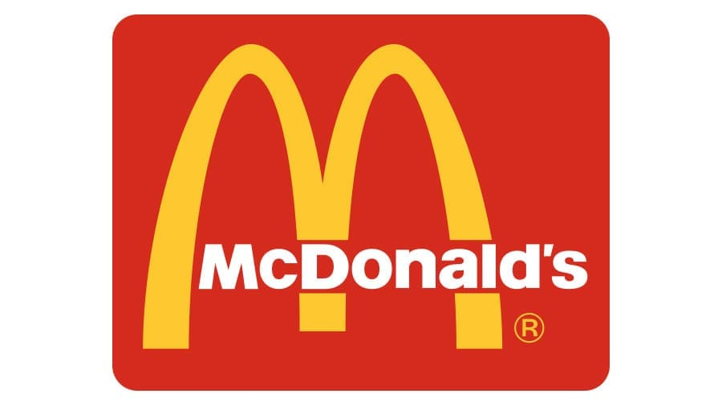
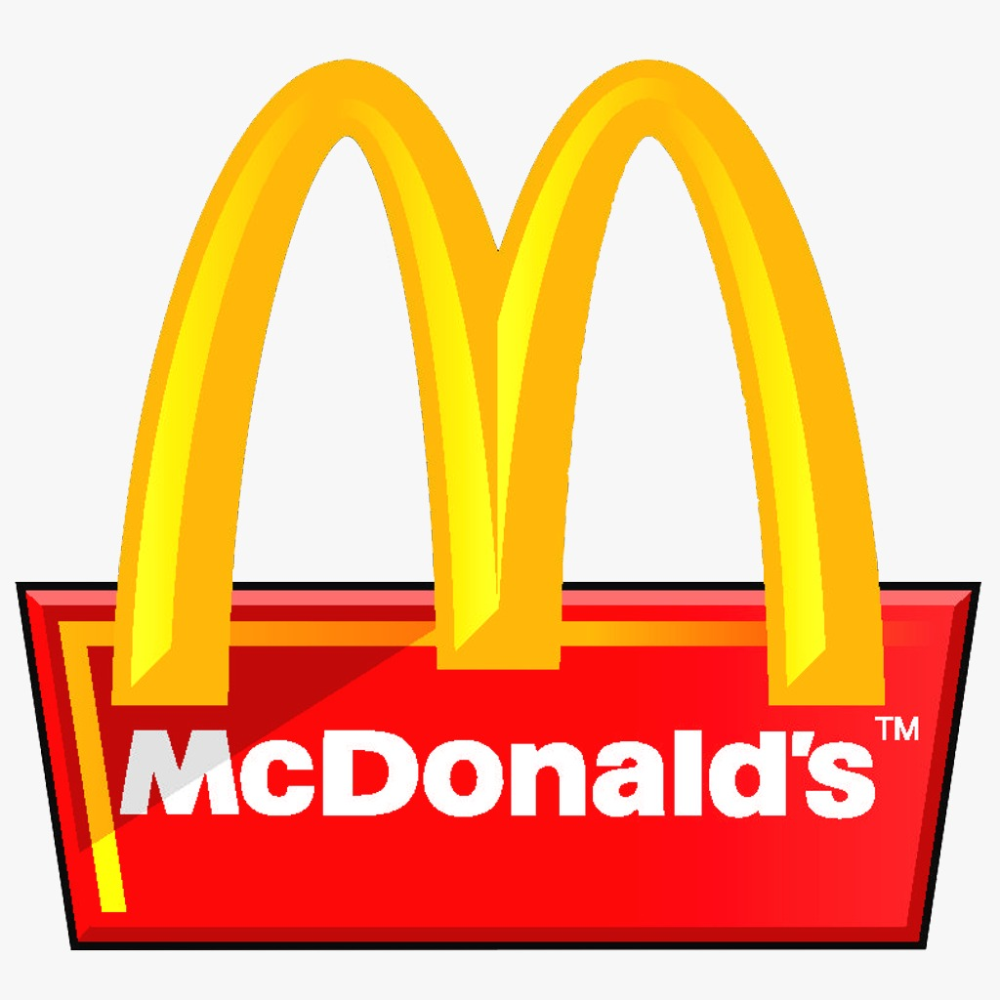
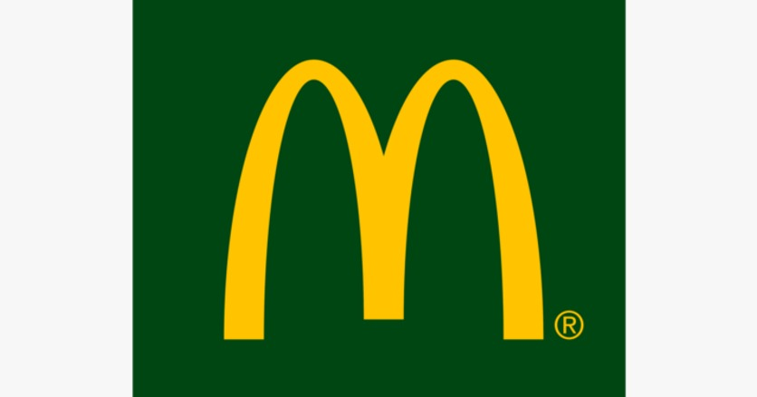
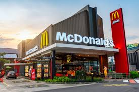

```{css, echo = FALSE}
.columns {display:flex;}
h1.title {font-size: 40 px;color: #d7231a}
h1 {color:#d7231a; font-size: 30px ;font-family: Arial Black}
h2{color: #fa3344; font-size: 20px; font-family: Arial}

body { background-color: #FFC40C}
a {color: #010101;}
.list-group-item.active, .list-group-item.active:focus, .list-group-item.active:hover {
    z-index: 2;
    color: ;
    background-color: #c4342d;
    border-color: palered;
}
.nav-pills > li.active > a, .nav-pills > li.active > a:hover, .nav-pills > li.active > 

```

```{r chunk-setup, include = FALSE}
knitr::opts_chunk$set(echo = TRUE, eval = TRUE, message = FALSE, warning = FALSE, 
                      #results = "hold",
                      cache = FALSE, cache.path = "/caches/", comment = "#>",
                      #fig.width = 7, #fig.height= 7,   
                      #out.width = 7, out.height = 7,
                      collapse = TRUE,  fig.show = "hold",
                      fig.asp = 0.628, out.width = "75%", fig.align = "center")
```

```{r options-setup, include = FALSE}
options(scipen = 999) #- para quitar la notación científica
options("yaml.eval.expr" = TRUE)
```

```{r klippy, echo = FALSE}
klippy::klippy(position = c("top", "right")) #- remotes::install_github("rlesur/klippy")
```


<hr class="linea-black">


Trabajo elaborado para la asignatura "Programación y manejo de datos en la era del Big Data" de la Universitat de València durante el curso 2021-2022. El repo del trabajo está [aquí](https://github.com/meneuf/trabajo_BigData_equipo){target="_blank"}. 


La página web de la asignatura y los trabajos de mis compañeros pueden verse [aquí](https://perezp44.github.io/intro-ds-21-22-web/07-trabajos.html){target="_blank"}.

<hr class="linea-red">


# [1. INTRODUCCIÓN]{.verdecito}

En el presente trabajo vamos a mostrar algunos datos de interés de una de las empresas multinacionales más conocidas a nivel mundial, McDonald's. Por un lado, veremos el menú de esta franquicia, así como los macronutrientes que contienen los productos y los valores nutricionales, mostrando y explicando los aspectos más relevantes. También trataremos de compararlo con otros grandes restaurantes de comida rápida en los Estados Unidos, país que acoge más cantidad de marcas de restaurantes de comida rápida en el mundo por excelencia. En la parte final, comentaremos de forma general la popularidad de los locales por ciudad, así como la evolución de sus ventas a lo largo de los últimos años. Por lo que en este trabajo nuestro objetivo es informar y concienciar a los lectores un poco acerca de los productos ofrecidos por McDonald's así como el impacto que este ha tenido sobre la población estadounidense.



## 1.1 Breve Historia

El primer restaurante de McDonald's se ubicaba en California, en el año 1948, como un bar de carretera. Fueron los dos hermanos Maurice y Richard Mcdonald quien llevaron a cabo este proyecto. Los elementos que lo caracterizaban y fueron motivo del éxito eran; por un lado, se podía pedir y recoger los productos desde el coche, los grandes ventanales que tenían permitían ver desde fuera como el pedido se preparaba y por último, los bajos precios que lo diferenciaban de competidores. Este último estuvo a punto de llevar a los hermanos a la quiebra, por lo que estos tuvieron que cerrar el negocio y organizar una buena estrategia. Resumiendo, Ray A. Kroc, alguien importante en los negocios por aquella zona, vio el potencial del restaurante en si y con la cesión del derecho de comercializar la marca por parte de los hermanos, abrió otro restaurante en Illinois. Y así se podría decir que empezó este negocio que actualmente tiene tanto éxito.





## 1.2  Logos</FONT>. {.tabset}

### <FONT COLOR ="FF4D00">Logo1</FONT>


1940-1948:
La historia de la cadena de restaurantes de comida rápida más famosa del mundo comenzó en 1937 cuando Patrick McDonald lanzó «The Airdome», el primer restaurante de la familia. Tres años más tarde, sus hijos le cambiaron el nombre a «McDonald’s Famous Barbecue».
El primer logotipo del restaurante estaba compuesto por una marca denominativa negra, distribuida en tres niveles y ejecutada en tres estilos diferentes.


### <FONT COLOR="FF4D00">Logo2</FONT>

1948-1953:
El concepto de barbacoa fue reemplazado por las hamburguesas, que estaban ganando cada vez más popularidad en los Estados Unidos. El título del restaurante se modificó en 1948 y se rediseñó el logotipo. Se añade la especificación «buy em by the bag», para hacer hincapié en la posibilidad de consumir la comida también para llevar. En negrita (y repetido dos veces) aparece el precio super competitivo. Y un logotipo repleto de detalles, con la intención de resaltar todos los puntos fuertes del restaurante: la originalidad de la oferta, la modalidad de consumo y el ahorro.

### <FONT COLOR ="FF4D00">Logo3</FONT>

1953-1968:
La compañía finalmente cambió su nombre a simplemente MacDonald’s y aquí es donde comienza todo. El logo aún estaba lejos de lo que todos conocemos hoy, pero el color rojo apareció en la paleta de colores, dando la dirección correcta para la marca.Era un logotipo bastante memorable y reconocible, que permaneció en la empresa durante 15 años.

### <FONT COLOR="FF4D00">Logo4</FONT>

1961-1968:
Es 1961 y hemos llegado a un momento decisivo para McDonald’s: el momento en que aparecen por primera vez los famosos «Golden Arches». Para el proyecto de un punto de venta en Downey (California), los hermanos McDonald encargan dos gigantescos arcos dorados en los extremos de la estructura. La idea era que se viese mejor incluso desde lejos. El logotipo de 1961, diseñado por el director creativo Jim Schindler, está inspirado en este detalle arquitectónico. Y eso no es todo: además se introduce el amarillo, un color que infunde el buen humor y que seguirá formando parte de la identidad visual de la empresa.


### <FONT COLOR="FF4D00">Logo5</FONT>

1975:
La nueva imagen se incorporó a la identidad visual en 1975. El emblema con la marca denominativa se colocó dentro de un rectángulo rojo con ángulos redondeados. Las letras se cambiaron de negro a blanco, lo que parecía más amigable y acogedor.
Esta insignia es probablemente la versión más reconocible de todos los logotipos de leyendas de comida rápida y la compañía todavía la usa, siendo reconocible instantáneamente en todo el mundo y evocando una sensación de alegría, felicidad y pasión.


### <FONT COLOR="FF4D00">Logo6</FONT>

A partir de 1985  se modifica y simplifica una vez más el logotipo en varios puntos del mundo : los arcos se solapan para formar la letra M. Hemos llegado al antepasado directo del logotipo de hoy.


### <FONT COLOR="FF4D00">Logo7</FONT>

A partir de 2009, La compañía McDonald’s cambia su tradicional logo de color rojo por uno verde, según anunció la marca. Este cambio de color simboliza teóricamente una imagen más ecológica y una nueva estrategia por parte de la empresa. El cambio de logo es una de las técnicasde marketing que adoptó la cadena de comida rápida. Con el objetivo de mostrar un perfil más comprometido con la preservación de los recursos naturales, McDonald’s lanzó su nueva campaña que consiste en cambiar el tradicional fondo rojo de su logo por un color verde intenso.


### <FONT COLOR="FF4D00">Logo8</FONT>

1993-Hoy:
En Estados Unidos, McDonald's introdujo a nivel nacional una línea de café llamada "McCafé". A diferencia de lo que ocurre en otros países, "McCafé" es solo una línea de bebidas especiales, no una cafetería completa. El estilo del logotipo de McCafe no crea ningún vínculo con el logotipo de la marca matriz, McDonald’s. En cambio, las fuerzas del diseño detrás de McCafe han creado una identidad de marca distintiva y completamente independiente.

# 2. CARGAMOS DATOS Y PAQUETES 

Este trabajo ha sido posible realizarlo con la ayuda de varias fuentes de donde hemos sacado los datos. En la página web facilitada por la asignatura (kaggle), hemos utilziado principalmente 5 datasests, que los indicaremos en la última parte, en la bibliografía. Por otro lado, hemos accedido a documentos oficiales del restaurante obtenidos en formato excel y los hemos transformado para trabajar con ellos y obtener más datos.


```{r, eval = TRUE}
library(ggplot2)
library(dplyr)
library(reactable)
library(gt)
library(tibble)
library("plotly")
library(tidyverse)
library(hrbrthemes)
library(viridis)
library(patchwork)
library(gganimate)
library(wordcloud2)
library(webshot)
library(corrplot)
library(sqldf)
library(RColorBrewer) 
library(kableExtra)
library(ggThemeAssist)

menu <- rio::import("./datos/menu1.1.csv")
restaurantesUS <- rio::import("./datos/FastFoodRestaurants.csv")
fastfoodrestaurants <- rio::import("./datos/fastfoodrestaurants.csv")
ruta4 <- here::here("datos", "Datafiniti_Fast_Food_Restaurants_May19.csv")
fastfoodrestaurants19 <- rio::import(ruta4)
ingresos <- rio::import("./datos/ingresos1.csv")
ventas <- rio::import("./datos/sales.csv")
```


# 3. RESTAURANTES FAST FOOD EN ESTADOS UNIDOS

## 3.1 Número de restaurantes FastFood

En este apartado observamos  mediante el siguiente gráfico de barras el número de restaurantes de fast food en todo el país de EEUU. Hemos acotado entre los 10 nombres más populares, entre ellos McDonald's, Burguer King o Taco Bell.
```{r}
mas_restaurantes <- restaurantesUS %>% 
  group_by(name) %>% 
  mutate(n_restaurantes = sum(NN = n())) %>%
  distinct(name, n_restaurantes) %>%
  arrange(desc(n_restaurantes)) %>%
  filter(n_restaurantes >=192) 

  gg_restaurantes <- ggplot(mas_restaurantes, aes(name, n_restaurantes)) +
  geom_bar(stat = "identity") + theme(panel.grid.major = element_line(colour = "gray"),
    panel.grid.minor = element_line(colour = "gray"),
    panel.background = element_rect(fill = "#FFC40C",
        colour = "aliceblue"), plot.background = element_rect(fill = "#FFC40C"))
  
gg_restaurantes
```

Como podemos ver, por clara diferencia, la marca con más locales es McDonald's, seguida de Burguer King y luego de Taco Bell.

Una de las claves del éxito alcanzada por la empresa y que ha permitido su expansión mundial son las siguientes: por un lado, la consistencia. Esto es, en cualquier país en el que t encuentres, la experiencia en el restaurante va a ser muy similar, los clientes ya saben que esperar por lo que hace mucho más fáciles sus decisiones de que comer.  Después destacaríamos la innovación, para que el negocio no quede estancado. Muy frecuentemente la franquicia lanza nuevos productos como respuesta de las demandas del cliente, se podría decir que evolucionan con el tiempo, como veremos un poco más adelante.

## 3.2 Ingresos restaurantes FastFood

En el siguiente apartado, analizaremos los ingresos en miles de millones de dólares de los mismos 10 restaurantes más famosos de EEUU.

```{r}
 df_ingresos <- ggplot(ingresos, aes(x=reorder(Resturantes, Value), y=Value, fill=Resturantes))+
  geom_bar(stat="identity") +
  theme(legend.position = "none") +
  coord_polar(start = 0.01) +
  labs (x="Restaurantes") + labs(y="Miles de millones de dólares") + labs(title = "Ingresos de los Resturantes FastFood") + labs(subtitle = "En miles de millones de dólares") + theme(panel.background = element_rect(fill = "#FFC40C"),
    plot.background = element_rect(fill = "#FFC40C"))

df_ingresos
```


Como se observa claramente, en la primera posición volveríamos a encontrar a nuestro restaurante, que llega a los 40 mil millones de dólares anuales. Sus ingresos están muy por encima de cualquiera de las otras marcas.

# 4. MC DONALD'S
En este cuarto apartado, vamos a hablar sobre el restaurante en cuestión en términos generales y de los aspectos más relevantes.


## 4.1 Productos McDonalds

En la siguiente tabla, se pueden consultar todos los productos de la carta que ofrecen. Se muestran un total de 260 productos.
```{r}
df_menu <- menu %>%
select(Item)

reactable(df_menu, defaultPageSize =  8,  paginationType = "jump", showPageSizeOptions =  TRUE , pageSizeOptions =  c ( 10 , 50 , 100, 150, 200, 260 ),defaultColDef = colDef(
    align = "center",
    minWidth = 70,
    headerStyle = list(background = "#FFD700"),
    filterable = TRUE),  highlight = TRUE, outlined = TRUE,
    columns = list(
  `Item` = colDef(style = function(value) {
    if (value > 0) {
      color <- "#F5C710"}
      else {
      color <- "#B22222"
    }
    list(color = color, fontWeight = "bold",background = "#CD2626")
  })))
```


## 4.2 Categorias de productos en McDonalds

De entre todos los productos, estos se podrían diferenciar en las siguientes categorías:

```{r}
m <- list(
  l = 50,
  r = 50,
  b = 100,
  t = 100,
  pad = 4
)
marker = list(color = brewer.pal(9, "Set1"))
p <- plot_ly(
  x = menu$Category,
  marker = list(color = '#CD0BBC'),
    type = "histogram"
)%>%
  layout(         xaxis = list(title = ""),
         yaxis = list(title = ""),
         autosize = T)
p
```


Y aun que parezca sorprendente, este restaurante cuenta con más variedad en cafés y tés. Incluso aunque a primera vista lo más demandado sea una simple hamburguesa de carne, al menos en nuestro país. De lo que menos variedad hay sería de ensaladas. Quizá tenga sentido porque es uno de lo productos que se ha incorporado más recientemente.


# 5.VALORES NUTRICIONALES

A continuación, vamos a destacar los aspectos y los puntos más relevantes y quizá destacables de los productos que ofrece la marca pero en términos de los valores nutricionales.

## 5.1 ¿Cuál es el producto con más calorias?

El producto más calórico del restaurante, son los nugguets, también es porque cuenta con 40 piezas.
```{r}
df_calorias <- menu %>%
select(Item, Calories) 

dftop1 <- df_calorias %>% slice_max(Calories, n=1)

Imagen <- "https://i.pinimg.com/originals/d5/5f/03/d55f035c37d84ec55934ba6d469bedce.jpg"

dftop1 <- dftop1 %>% add_column(Imagen)

Tabla_Pmascal <- dftop1 %>% gt()

Tabla_Pmascal <- Tabla_Pmascal %>%
                   tab_header(title = md("**Producto con mas calorias**"))
                   
Tabla_Pmascal <- Tabla_Pmascal %>%
                tab_options(heading.background.color = "coral") %>% tab_options(heading.title.font.size = 15,  column_labels.font.weight =  "bold")


Tabla_Pmascal <- Tabla_Pmascal  %>%
  gt::text_transform(locations = cells_body(columns = c(Imagen)), fn = function(x) {gt::web_image(x, height = 50)}) %>%  cols_align(
   align = "center")

Tabla_Pmascal
```


## 5.2 ¿Cuál es el producto con menos calorias?

El menos calórico, lógicamente sería la botella de agua
```{r}
dfmin1 <- df_calorias %>% 
slice_min(Calories, n=1) %>%
filter (Item == "Dasani Water Bottle") #Dasani Water Bottle es uno de los productos con menos calorias 

Imagen <- "https://i.pinimg.com/originals/3c/df/ae/3cdfaeaa504db8aaf100843a12aacc97.png"

dfmin1 <- dfmin1 %>% add_column(Imagen)


Tabla_Pmincal <- dfmin1 %>% gt()

Tabla_Pmincal <- Tabla_Pmincal %>%
                   tab_header(title = md("**Producto con menos calorias**"))
                   
Tabla_Pmincal <- Tabla_Pmincal %>%
                tab_options(heading.background.color = "coral") %>% tab_options(heading.title.font.size = 15,  column_labels.font.weight =  "bold")


Tabla_Pmincal <- Tabla_Pmincal  %>%
  gt::text_transform(locations = cells_body(columns = c(Imagen)), fn = function(x) {gt::web_image(x, height = 50)}) %>%  cols_align(
   align = "center")

Tabla_Pmincal
```


## 5.3.  Productos con mayor macronutrientes</FONT>. {.tabset}

En este apartado, vamos a mostrar por separado, que 10 productos, en primer lugar, tienen más proteínas, luego cuáles cuentan con más grasas y cual está compuesto con más carbohidratos.

En los gráficos de cada macronutriente podemos verlo, sosteniendo el cursor sobre ellos.


### <FONT COLOR="FF4D00">Proteina</FONT>
```{r}
df14prod <- menu %>%
  select(Item, Protein) %>%
  head(Protein, n = 10L)%>%
  group_by(Item, Protein) %>%
  arrange(desc(Protein))

df14prod

wordcloud2(data=df14prod, size=0.1)
```


### <FONT COLOR="FF4D00">Grasas</FONT>
```{r}
totalfat <- menu %>%
 select(Item, Fat) 


df_fat <- totalfat %>%
head(Fat, n= 10L) %>%
group_by(Item, Fat) %>%
arrange(desc(Fat))

df_fat


plot_ly(x = df_fat$Item, y=df_fat$Fat,color = df_fat$Item,colors = palette("Pastel 2"), type = "box") %>% 
  layout(title = "Los 10 productos con más grasa",
         xaxis = list(title = ""),
         yaxis = list(title = ""),
         showlegend=FALSE,
         autosize = T) 
```
 

### <FONT COLOR="FF4D00">Carbohidratos</FONT>
```{r} 
carbos <- menu %>%
select(Item,Carbohydrates)

df_carbos <- carbos %>%
head(Carbohydrates, n= 10L) %>%
group_by(Item, Carbohydrates) %>%
arrange(desc(Carbohydrates))

df_carbos

plot_ly(x = df_carbos$Item, y=df_carbos$Carbohydrates,color = df_carbos$Item, colors = palette("alphabet"), type = "box") %>% 
         layout(title="Los 10 productos con más carbohidratos",
         xaxis = list(title = ""),
         yaxis = list(title = ""),
         showlegend=FALSE,
         autosize = T)
```


En cuanto al producto con más proteínas se encontraría el Steak & Egg McMuffin, que se encuenta dentro de la sección de los desayunos. Con más grasa y a la vez con más hidratos tendríamos al Bacon, Egg & Cheese Biscuit (Large Biscuit).


## 5.4.  Productos con mayor micronutrientes </FONT>. {.tabset} 

### <FONT COLOR="FF4D00">VitaminaA</FONT>
En este apartado, repetimos la misma operación que en el punto anterior pero ahora con los micronutrientes, separados en: vitamina A y C, fibra, calcio y hierro. En la parte inferior de cada lista, lo podemos observar también gráficamente

```{r}
vitaminaA <- menu %>%
select(Item,VitaminA)

df_vitamina1 <- vitaminaA %>%
head(VitaminA, n= 10L)%>%
arrange(desc(VitaminA))

df_vitamina1

grafico <- df_vitamina1 %>%
  ggplot( aes(Item, VitaminA, size = 0.75, color= "orange")) +
  geom_point() +
  theme_bw()+ 
  theme(legend.position = "none") +
  labs(x = NULL) + theme(axis.title.x=element_blank(),
        axis.text.x=element_blank(),
        axis.ticks.x=element_blank()) + labs(title= "Los 10 productos con más Vitamina A") +
  theme(panel.background = element_rect(fill = 'wheat1', colour = 'red')) + theme(panel.background = element_rect(fill = "#FFC40C"),
    plot.background = element_rect(fill = "#FFC40C",
        colour = "#FFC40C"))

ggplotly(grafico)
```


### <FONT COLOR="FF4D00">VitaminaC</FONT>
```{r}
vitaminaC <- menu %>%
select(Item,VitaminC)

df_vitamina2 <- vitaminaC %>%
head (VitaminC, n = 10L)%>%
arrange(desc(VitaminC))

df_vitamina2


dfgrafico1 <- ggplot(df_vitamina2, aes(Item, color=VitaminC)) + 
  geom_bar(fill=NA) + 
  coord_flip() +
  theme(panel.background = element_rect(fill = 'lightblue1')) + theme(panel.background = element_rect(fill = "#FFC40C"),
    plot.background = element_rect(fill = "#FFC40C"),
    legend.background = element_rect(fill = "#FFC40C"))

ggplotly(dfgrafico1)
```


### <FONT COLOR="FF4D00">Fibra</FONT>        
```{r}        
        
fibra <- menu %>%
select(Item,DietaryFiber)

df_fibra <- fibra %>%
head(DietaryFiber, n= 10L) %>%
arrange(desc(DietaryFiber))

df_fibra


m <- list(
  l = 50,
  r = 50,
  b = 100,
  t = 100,
  pad = 4
)
marker = list(color = brewer.pal(9, "Set1"))
p <- plot_ly(
  x = menu$Category,
  marker = list(color = '#45171D')
)
                
menu %>%  
plot_ly( x = df_fibra$Item, y = df_fibra$DietaryFiber, type="scatter", mode = "markers" , marker=list( color=colorRampPalette(brewer.pal(8,"Dark2"))(100) , opacity=0.9) ) %>% layout(title = "Los 10 productos con más fibra",
         xaxis = list(title = ""),
         yaxis = list(title = ""),
         showlegend=FALSE,autosize = F, width = 500, height = 400,margin=m)
```


### <FONT COLOR="FF4D00">Calcio</FONT>
```{r}        
calcio <- menu %>%
select(Item,Calcium)

df_calcium <- calcio %>%
head(Calcium, n= 10L) %>%
arrange(desc(Calcium))

df_calcium


p <- ggplot(df_calcium, aes(Item, Calcium)) + 
  geom_point() + 
  geom_segment(aes(x=forcats::fct_reorder(Item, Calcium, .desc = TRUE),
                   xend=forcats::fct_reorder(Item, Calcium, .desc = TRUE),
                   y=0,
                   yend=Calcium, color=palette("Tableau 10"))) + 
  geom_smooth() +
  theme(axis.title.x=element_blank(),
        axis.text.x=element_blank(),
        axis.ticks.x=element_blank()) +
  labs(title = "Los 10 productos con más calcio",
              subtitle = "anño 2019", 
              caption = "Datos provenientes de Kaggle",
              x = "Productos",
              y = "Calcio") +
  theme(legend.position="none") + theme(panel.background = element_rect(fill = "#FFC40C"),
    plot.background = element_rect(fill = "#FFC40C"))


ggplotly(p)
```


### <FONT COLOR="FF4D00">Hierro</FONT>
```{r}
hierro <- menu %>%
 select(Item, Iron) 

df_hierro <- hierro %>%
head(Iron, n= 10L) %>%
group_by(Item, Iron) %>%
arrange(desc(Iron))

df_hierro

df <- ggplot(df_hierro, aes(x=Item, y=Iron)) +
  geom_segment( aes(x=Item, xend=Item, y=0, yend=Iron)) +
  geom_point( size=5, color="red", fill=alpha("orange", 0.3), alpha=0.7, shape=21, stroke=2) + theme(axis.title.x=element_blank(),
        axis.text.x=element_blank(),
        axis.ticks.x=element_blank()) +  labs(title = "Los 10 productos con más calcio",
              subtitle = "anño 2019", 
              caption = "Datos provenientes de Kaggle",
              x = "Productos",
              y = "Calcio") + 
  theme(panel.background = element_rect(fill = "#FFC40C"),
    plot.background = element_rect(fill = "#FFC40C"))

ggplotly(df)
```


El desayuno de Sausage McMuffin with Egg, es el que encontramos con más vitamina A y el Bacon, Egg & Cheese Biscuit (Regular Biscuit), con más vitamina C.

En cuanto al alimento con más fibra, diríamos el Egg McMuffin, que en lugar de carne, posee un huevo en su interior.

Sausage McMuffin with Egg vuelve a repetirse como el producto con más calcio de entre todos y Steak & Egg McMuffin es el que aparece con más hierro.


## 5.5 Correlación

En este gráfico se concentra y se muestra la correlación que tienen entre sí los nutrientes de los productos que se encuentran en la carta de McDonald's.
```{r}
menu <- na.omit(menu)
scaledmenu <- data.frame(scale(menu[c(4:24)]))
menu1<-cbind(menu[1:3],scaledmenu)

M <- cor(scaledmenu)
cex.before <- par("cex")
par(cex = 0.7)
corrplot(M, insig = "blank", method = "square",  tl.cex = .75)
par(cex = cex.before)
```


## 5.6. Combi perfecta

En este punto llamamos combi perfecta, al producto menos calórico de cada categoría.
Esto hace posible que aun siendo Mc Donald's un lugar de comida poco saludable se pueda saber que opciones puede coger un cliente que pretenda comer las menos calorías posibles por lo que al tener los productos menos calóricos de cada categoria, el cliente puede conformarse así su propio menú atendiendo a lo que este solicita.
```{r}
Mincal<-aggregate(menu$Calories, by=list(menu$Category), FUN=min)
colnames(Mincal)[1]<-"Category"
colnames(Mincal)[2]<-"Calories"
Mincalmenu<-sqldf("select a.Category,a.Item, a.Calories from menu a, Mincal b where a.Category==b.Category and a.Calories==b.Calories" )
## The below table gives the minumum Calorie Item from Each Category
Mincalmenu


knitr::kable(Mincalmenu) %>%
  kableExtra::kable_styling(full_width = F) %>%
  column_spec(1, bold = T, border_right = T) %>%
  row_spec(1, bold = T, color = "white", background = palette("Pastel 2")) %>% 
  row_spec(2:2, bold = T, color = "white", background = palette("Tableau 10") ) %>%
  row_spec(3:3, bold = T, color = "white", background = palette("Polychrome 36") ) %>%
  row_spec(4:5, bold = T, color = "white", background = palette("Okabe-Ito") ) %>%
  row_spec(6:6, bold = T, color = "white", background = palette("Paired") ) %>%
  row_spec(7:7, bold = T, color = "white", background = "#2297E6") %>%
  row_spec(8:16, bold = T, color = "white", background = "#28E2E5") %>% 
  row_spec(17:23, bold = T, color = "white", background = "#61D04F") %>%
  row_spec(24:25, bold = T, color = "white", background = "#DF536B") %>% 
  row_spec(0, angle = 0)
```


# 6.TIPOS DE ALIMENTOS

Como todos sabemos McDonald's ofrece una carta muy amplia de productos de todo tipo, más grandes o más pequeños, más calórico o menos, más sanos o menos nutricionalmente hablando, etc. 
Es conocido sobretodo por las comidas y cenas siendo estas en las que van más clientes, sin embargo Mc donald's desde que abrio la zona de Mc Cafe cuenta con una gran variedad de cafés para cualquier hora del día así como de desayunos y de snacks. Y cabe destacar que también ha querido adaptarse a opciones más saludables para así llegar a todas las personas, ofreciendo comida más sana y menos sana.Por eso vamos a mostrar 3 tipos de alimentos, que probablemente no sean conocidos ni asociados a una franquicia como Mc Donald's tan arraigada a las hamburguesas.

## 6.1.Breakfast


```{r}
ggplot(subset(menu,Category=="Breakfast"), aes(reorder(Item,Calories),Calories,fill=Calories)) + geom_bar(stat = "identity")  + theme(legend.position = "none")+ggtitle("Breakfast Vs Calories") + xlab("Item") + ylab("Calories")  + coord_flip() + theme(panel.background = element_rect(fill = "#FFC40C"),
    plot.background = element_rect(fill = "#FFC40C"))
```


## 6.2. Salad Menu
```{r}
ggplot(subset(menu,Category=="Salads"), aes(reorder(Item,Calories),Calories,fill=Calories)) + geom_bar(stat = "identity")  + theme(legend.position = "none")+ggtitle("Salads Menu Vs Calories") + xlab("Item") + ylab("Calories")  + coord_flip() + theme(panel.background = element_rect(fill = "#FFC40C"),
    plot.background = element_rect(fill = "#FFC40C"))
```


## 6.3. Snacks 
```{r}
ggplot(subset(menu,Category=="Snacks & Sides"), aes(reorder(Item,Calories),Calories,fill=Calories)) + geom_bar(stat = "identity")  + theme(legend.position = "none")+ggtitle("Snacks & Sides Menu Vs Calories") + xlab("Item") + ylab("Calories")  + coord_flip() + theme(panel.background = element_rect(fill = "#FFC40C"),
    plot.background = element_rect(fill = "#FFC40C"))
```


## 6.4. Coffee and Tea
```{r}
Coffeeandtea<-subset(menu,Category=="Coffee & Tea")
Coffeeandtea <- Coffeeandtea[order(-Coffeeandtea$Calories),]
Coffeeandtea<-Coffeeandtea[1:20,]
ggplot(Coffeeandtea, aes(reorder(Item,Calories),Calories,fill=Calories)) + geom_bar(stat = "identity")  + theme(legend.position = "none")+ggtitle("Coffee & Tea Menu Vs Calories") + xlab("Item") + ylab("Calories")  + coord_flip() + theme(panel.background = element_rect(fill = "#FFC40C"),
    plot.background = element_rect(fill = "#FFC40C"))
```
 


# 7.POPULARIDAD

En este apartado analizarmeos y mostraremos la "popularidad" de nuestro restaurante en algunas de las ciudades de EEUU, a través de un gráfico de barras. Veremos el número de locales de la franquicia con los que cuentan las ciudades que se muestran.




```{r} 
nummac <- restaurantesUS %>%
  select(city, name) %>%
   group_by(city) %>% 
  mutate(nn_mac = sum(NN=n())) %>% 
  filter(name == "McDonald's") %>% 
  distinct(city, nn_mac) %>%
  ungroup()

top10 <- nummac %>%
  slice_max(nn_mac , n=10) 

grafico1 <- ggplot (top10, aes(x=nn_mac, y = city), aes(fct_rev(nn_mac))) + geom_bar(stat="identity", fill = "red") + coord_flip() + labs(x = "Numero de McDonalds", y = "City")+labs(title = "Locales por ciudad")  + theme(panel.background = element_rect(fill = "#FFC40C"),
    plot.background = element_rect(fill = "#FFC40C"))

grafico1
```


Con gran ventaja sobre los demás, la ciudad que cuenta con más locales sería Cincinnati.

Y es que este restaurante es mundialmente reconocido, tanto por ser una organización comercial de alta calidad, como por ser una de las mejores oportunidades de oferta de Franquicias. Puede pues, que la clave de su éxito es tener una base muy firme en sus franquiciatarios.

# 8. VENTAS

Por último, vamos a hablar sobre las ventas del restaurante, información que hemos considerado importante tener en cuenta y por ello mostraros. Y es que esta marca cuenta con 26 mil locales en todo el mundo, 14 mil millones de comidas vendidas al año, 5 establecimientos nuevos se abren cada día, venta de 145 hamburguesas por segundo y un millón y medio de empleados.

```{r}
ventasmc <- ventas%>%
  select(Años,Ventas)


 ggplot( data= ventas, aes(x=Años, y=Ventas)) +
    geom_line() +
    geom_point() +
    ggtitle("Evolución de las ventas de MC Donald's desde 2005-2019") +
   theme_ipsum() +
    ylab("Número de ventas") +
    transition_reveal(Años) + theme(plot.subtitle = element_text(family = "sans"),
    plot.caption = element_text(family = "sans"),
    axis.title = element_text(family = "sans"),
    plot.title = element_text(family = "sans"),
    panel.background = element_rect(fill = "#FFC40C"),
    plot.background = element_rect(fill = "#FFC40C"))
```

En este gráfico vemos la evolución de las ventas de McDonald's entre 2005 y 2019

## 8.1 Locales y empleados

```{r}

grafloc <- ggplot( data= ventas, aes(x=Años, y=Locales)) 
  
 grafloc +  geom_line() +
    geom_point() +
    ggtitle("Evolución de los establecimientos de MC Donald's desde 2005-2019") +
   theme_ipsum() +
    ylab("Número de establecimientos") +
    transition_reveal(Años)+
      labs(subtitle = "En miles") + theme(plot.subtitle = element_text(family = "sans"),
    plot.caption = element_text(family = "sans"),
    axis.title = element_text(family = "sans"),
    plot.title = element_text(family = "sans"),
    panel.background = element_rect(fill = "#FFC40C"),
    plot.background = element_rect(fill = "#FFC40C"))
```

```{r}
 empleados <- ventas%>%
  select(Años,Empleados)
  
  grafempl <- ggplot( data= ventas, aes(x=Años, y=Empleados)) 
   grafempl+  geom_line() +
    geom_point() +
    ggtitle("Evolución del número de empleados de MC Donald's desde 2013-2019") +
   theme_ipsum() +
    ylab("Número de Empleados") +
    transition_reveal(Años) + theme(plot.subtitle = element_text(family = "sans"),
    plot.caption = element_text(family = "sans"),
    axis.title = element_text(family = "sans"),
    plot.title = element_text(family = "sans"),
    panel.background = element_rect(fill = "#FFC40C"),
    plot.background = element_rect(fill = "#FFC40C"))
 empleados<- na.omit(empleados)
```
 
 
Particularmente McDonald’s resulta un caso interesante a contemplar puesto que año con año es posible notar que tiene menos empleados pero crece de forma importante. La firma que en su momento pudo llegar a presumir de haber contratado a uno de cada ocho trabajadores en los Estados Unidos ha ido reduciendo la cantidad de colaboradores, cosa que podría parecer negativa pues el crecimiento muchas veces implica que es necesario sumar a más personas.
Tal como lo presentamos en la gráfica de este día, de 2012 a 2018 es posible notar como ha ido disminuyendo de forma significativa la cantidad de empleados de McDonald’s a nivel global. Como se logra observar, durante 2012 había 440 mil trabajadores, para 2015 ya eran 420 mil mientras que para el año 2018 la cantidad ya se había reducido a la mitad con respecto a lo reportado en 2015, es decir, se tiene registro de solo 210 mil empleados hasta el año pasado.
 
¿Por qué hay menos empleados si hay más restaurantes?

El hecho de que la marca de los arcos dorados tenga menos personal y más restaurantes obedece principalmente a la visión a futuro de la compañía, a la tecnología y la forma en que ha decidido gestionarse. Específicamente en el caso de los empleados, es posible notar que McDonald’s ha decidido apostar en gran medida por acciones como la opción de que las personas pidan su comida a través de apps desde las cuales pueden incluso pagar y otras herramientas de self-service en los restaurantes, como kioscos desde los cuales los consumidores se encargan de gestionar sus órdenes. Se espera que para finales de este año, en Estados Unidos, más de 12 mil ubicaciones de McDonald’s cuenten con menús digitales y kioscos de autoservicio.


# CONCLUSION
Después del análisis realizado en el presente trabajo podemos llegar a una serie de conclusiones respecto al restaurante en cuestión: Mc Donald’s. La franquicia más exitosa a nivel mundial, a pesar de haberse enfrentado a desafíos de competencia a nivel mundial, sigue en el top 1 de restaurantes del mundo.

Como todo el mundo sabe, el menú siempre ha sido muy parecido a lo largo de los años, suelen incorporar nuevos productos, suprimir otros, en función del éxito que tengan, pero como hemos mencionado anteriormente sí que es verdad que como destino para comer algo es una apuesta segura porque sabes perfectamente lo que vas a comer, el entorno o el local en el que te vas a encontrar, el ambiente, etc. Ya que todos los restaurantes, estés en la parte del mundo en la que estés, son muy similares entre sí. 

A pesar de las críticas y opiniones que recibe este restaurante de comida rápida, la variedad de productos que ofrece es muy amplia y permite que el consumidor tenga diferentes opciones al gusto.

Otro aspecto importante comentado en este trabajo, es que aún que la gente no se pare a pensarlo, esta marca hace una gran labor social, con impacto positivo a la sociedad. Como por ejemplo en términos de puestos de trabajo, o como se menciona en la última parte, la inversión en nuevos métodos tecnológicos y la visión para el futuro que se prevé siempre adaptándose a los distintos cambios que suceden a nuestro alrededor.

Nuestro objetivo con este proyecto, y esperamos que conseguido, es dar a conocer un poco más el restaurante en lo que se trata de los productos que ofrece. Aunque ya bastante conocida es la marca y su menú, no está de más conocer completamente o por lo menos detalladamente los aspectos comentados aquí.

Por último, mencionar que el éxito que tuvo la franquicia en sus inicios ha continuado a lo largo de todos estos últimos años y se prevé que continúe al menos los mismos años que ya lleva en pie. Porque como ya hemos mencionado, es un destino atractivo para el público sobre todo joven y mientras siga así la demanda, la oferta no será menos.


# BIBLIOGRAFIA

- [enlace a la página web de la asignatura](https://perezp44.github.io/intro-ds-21-22-web/index.html)
- [enlace galeria de gráficos de ggplot2](https://www.r-graph-gallery.com/)
- [repositorio de los datos del trabajo](https://www.kaggle.com/jesyfax/mc-donald-menu-analysis)
- [repositorio de los datos del trabajo](https://www.kaggle.com/marcdeveaux/mcdonald-s-menu/script)
- [repositorio de los datos del trabajo](https://www.kaggle.com/devisangeetha/calories-we-eat-in-mcdonald-s/report)
- [repositorio de los datos del trabajo](https://www.kaggle.com/marcdeveaux/mcdonald-s-menu/script)
- [repositorio de los datos del trabajo](https://www.kaggle.com/adhok93/nutrition-value-in-mcdonald-s-food/report)
- [enlace a la página web de los datos económicos del trabajo](https://infogram.com/ingresos-anuales-de-mcdonalds-miles-de-millones-de-dolares-1hnq41ql0w3d63z)
- [enlace a la página web de los datos económicos del trabajo](https://es.wikipedia.org/wiki/Anexo:Cadenas_de_comida_r%C3%A1pida_por_ingreso_anual)
```


<br><br>

<div class="tocify-extend-page" data-unique="tocify-extend-page" style="height: 0;"></div>


