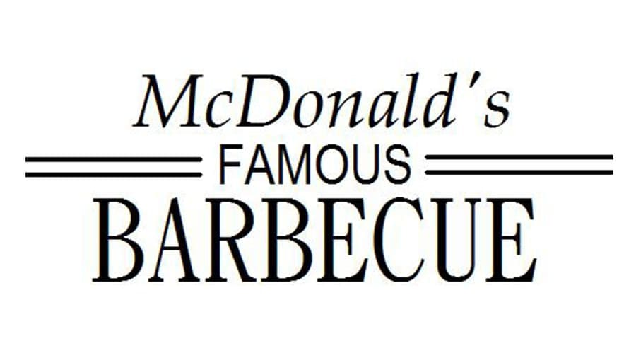
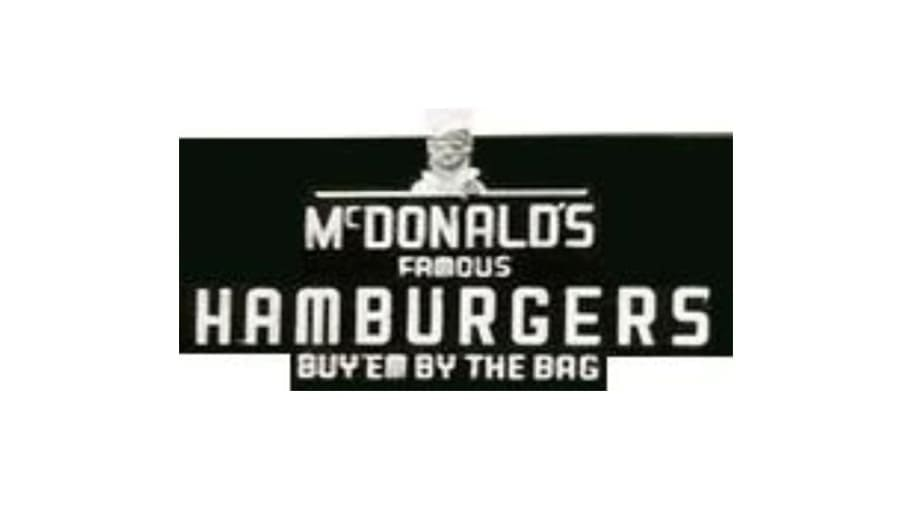

```{r chunk-setup, include = FALSE}
knitr::opts_chunk$set(echo = TRUE, eval = TRUE, message = FALSE, warning = FALSE, 
                      #results = "hold",
                      cache = FALSE, cache.path = "/caches/", comment = "#>",
                      #fig.width = 7, #fig.height= 7,   
                      #out.width = 7, out.height = 7,
                      collapse = TRUE,  fig.show = "hold",
                      fig.asp = 0.628, out.width = "75%", fig.align = "center")


```

```{r options-setup, include = FALSE}
options(scipen = 999) #- para quitar la notación científica
options("yaml.eval.expr" = TRUE)
```

```{r klippy, echo = FALSE}
klippy::klippy(position = c("top", "right")) #- remotes::install_github("rlesur/klippy")
```


<hr class="linea-black">

<!-- El párrafo de abajo has de dejarlo casi igual, solo HAS de SUSTITUIR "perezp44" por tu usuario de Github-->
Trabajo elaborado para la asignatura "Programación y manejo de datos en la era del Big Data" de la Universitat de València durante el curso 2021-2022. El repo del trabajo está [aquí](https://github.com/meneuf/trabajo_BigData_equipo){target="_blank"}. 

<!-- El párrafo de abajo has de dejarlo exactamente igual, NO has de cambiar nada-->

La página web de la asignatura y los trabajos de mis compañeros pueden verse [aquí](https://perezp44.github.io/intro-ds-21-22-web/07-trabajos.html){target="_blank"}.

<hr class="linea-red">


# [1. Introducción]{.verdecito}

En el presente trabajo vamos a mostrar algunos datos de interés de una de las empresas multinacionales más conocidas a nivel mundial, McDonald's. Por un lado, veremos el menú de esta franquicia, así como los macronutrientes que contienen los productos y los valores nutricionales, mostrando y explicando los aspectos más relevantes. También trataremos de compararlo con otros grandes restaurantes de comida rápida en los Estados Unidos, país que acoge más cantidad de marcas de restaurantes de comida rápida en el mundo por excelencia.+


## 1.1 Breve Historia

El primer restaurante de McDonald's se ubicaba en California, en el año 1948, como un bar de carretera. Fueron los dos hermanos Maurice y Richard Mcdonald quien llevaron a cabo este proyecto. Los elementos que lo caracterizaban y fueron motivo del éxito eran; por un lado, se podía pedir y recoger los productos desde el coche, los grandes ventanales que tenían permitían ver desde fuera como el pedido se preparaba y por último, los bajos precios que lo diferenciaban de competidores. Este último estuvo a punto de llevar a los hermanos a la quiebra, por lo que estos tuvieron que cerrar el negocio y organizar una buena estrategia. Resumiendo, Ray A. Kroc, alguien importante en los negocios por aquella zona, vio el potencial del restaurante en si y con la cesión del derecho de comercializar la marca por parte de los hermanos, abrió otro restaurante en Illinois. Y así se podría decir que empezó este negocio que actualmente tiene tanto éxito.


La introducción **es una de las partes importantes del trabajo**. En la introducción suele ponerse el objetivo, motivación, un pequeño resumen del trabajo y avance de conclusiones si es que hay.


## 1.2  ## <FONT COLOR="sky-blue">2. LOGOS</FONT>. {.tabset}

### <FONT COLOR="FF4D00">Logo1</FONT>



### <FONT COLOR="FF4D00">Logo2</FONT>


### <FONT COLOR="FF4D00">Logo3</FONT>


### <FONT COLOR="FF4D00">Logo4</FONT>


### <FONT COLOR="FF4D00">Logo5</FONT>


### <FONT COLOR="FF4D00">Logo6</FONT>


### <FONT COLOR="FF4D00">Logo7</FONT>


### <FONT COLOR="FF4D00">Logo8</FONT>


```{r, eval = TRUE}
2 + 2
```

Yo no usaría CSS, bastante trabajo tenéis, pero ... si usas CSS para tunear tu html podrás dejarlo más bonito, o al menos más a tu gusto. Por ejemplo, podrás fácilmente cambiar el tamaño de algunas palabras, por ejemplo, **[unas palabras en grande y en negrita]{.large}**, aunque si estas usando CSS saldrán en verde porque en el CSS he puesto que la negrita salga en verde. Por ejemplo, podrás poner fácilmente [unas palabras en purple]{.purple}, y ahora, [[en grande y en rojito]{.rojito}]{.large}.

# 2. Cargamos datos y paquetes

Este trabajo ha sido posible realizarlo con la ayuda de varias fuentes de donde hemos sacado los datos. En la página web facilitada por la asignatura (kaggle), hemos utilziado principalmente 5 datasests, que los indicaremos en la última parte, en la bibliografía. Por otro lado, hemos accedido a documentos oficiales del restaurante para obtener más datos.


Una parte **importante** del trabajo es explicar **de donde proceden los datos** y cual ha sido el proceso de limpieza

```{r, eval = TRUE}
library(ggplot2)
library(dplyr)
library(reactable)
library(gt)
library(tibble)
library("plotly")
library(tidyverse)
library(hrbrthemes)
library(viridis)
library(patchwork)
library(gganimate)
library(wordcloud2)
library(webshot)
library(corrplot)
library(sqldf)
library(RColorBrewer) 

menu <- rio::import("./datos/menu1.1.csv")
restaurantesUS <- rio::import("./datos/FastFoodRestaurants.csv")
fastfoodrestaurants <- rio::import("./datos/fastfoodrestaurants.csv")
ruta4 <- here::here("datos", "Datafiniti_Fast_Food_Restaurants_May19.csv")
fastfoodrestaurants19 <- rio::import(ruta4)
ingresos <- rio::import("./datos/ingresos1.csv")
ventas <- rio::import("./datos/sales.csv")
```


# 3.Restaurantes FastFood en EEUU

## 3.1 Número de restaurantes FastFood
```{r}
mas_restaurantes <- restaurantesUS %>% 
  group_by(name) %>% 
  mutate(n_restaurantes = sum(NN = n())) %>%
  distinct(name, n_restaurantes) %>%
  arrange(desc(n_restaurantes)) %>%
  filter(n_restaurantes >=192) 

  gg_restaurantes <- ggplot(mas_restaurantes, aes(name, n_restaurantes)) +
  geom_bar(stat = "identity")
  
gg_restaurantes

```


## 3.2 Ingresos restaurantes FastFood
```{r}

 df_ingresos <- ggplot(ingresos, aes(x=reorder(Resturantes, Value), y=Value, fill=Resturantes))+
  geom_bar(stat="identity") +
  theme(legend.position = "none") +
  coord_polar(start = 0.01) +
  labs (x="Paises") + labs(y="Miles de millones de dólares") + labs(title = "Ingresos de los Resturantes FastFood") + labs(subtitle = "En miles de millones de dólares")

df_ingresos

```

# 4.McDonalds

## 4.1 Productos McDonalds
```{r}
df_menu <- menu %>%
select(Item)

reactable(df_menu, defaultPageSize =  8,  paginationType = "jump", showPageSizeOptions =  TRUE , pageSizeOptions =  c ( 10 , 50 , 100, 150, 200, 260 ),defaultColDef = colDef(
    align = "center",
    minWidth = 70,
    headerStyle = list(background = "red"),
    filterable = TRUE),  highlight = TRUE, outlined = TRUE,
    columns = list(
  `Item` = colDef(style = function(value) {
    if (value > 0) {
      color <- "#F5C710"}
      else {
      color <- "#e000000"
    }
    list(color = color, fontWeight = "bold")
  })))
```

## 4.2 Categorias de productos en McDonalds
```{r}
m <- list(
  l = 50,
  r = 50,
  b = 100,
  t = 100,
  pad = 4
)
marker = list(color = brewer.pal(9, "Set1"))
p <- plot_ly(
  x = menu$Category,
  marker = list(color = '#CD0BBC'),
    type = "histogram"
)%>%
  layout(         xaxis = list(title = ""),
         yaxis = list(title = ""),
         autosize = T)
p

display.brewer.all()

```


# 5.VALORES NUTRICIONALES

## 5.1 ¿Cuál es el producto con más calorias?
```{r}
df_calorias <- menu %>%
select(Item, Calories) 

dftop1 <- df_calorias %>% slice_max(Calories, n=1)

Imagen <- "https://i.pinimg.com/originals/d5/5f/03/d55f035c37d84ec55934ba6d469bedce.jpg"

dftop1 <- dftop1 %>% add_column(Imagen)

Tabla_Pmascal <- dftop1 %>% gt()

Tabla_Pmascal <- Tabla_Pmascal %>%
                   tab_header(title = md("**Producto con mas calorias**"))
                   
Tabla_Pmascal <- Tabla_Pmascal %>%
                tab_options(heading.background.color = "coral") %>% tab_options(heading.title.font.size = 15,  column_labels.font.weight =  "bold")


Tabla_Pmascal <- Tabla_Pmascal  %>%
  gt::text_transform(locations = cells_body(columns = c(Imagen)), fn = function(x) {gt::web_image(x, height = 50)}) %>%  cols_align(
   align = "center")

Tabla_Pmascal

```


## 5.2 ¿Cuál es el producto con menos calorias?

```{r}
dfmin1 <- df_calorias %>% 
slice_min(Calories, n=1) %>%
filter (Item == "Dasani Water Bottle") #Dasani Water Bottle es uno de los productos con menos calorias 

Imagen <- "https://i.pinimg.com/originals/3c/df/ae/3cdfaeaa504db8aaf100843a12aacc97.png"

dfmin1 <- dfmin1 %>% add_column(Imagen)


Tabla_Pmincal <- dfmin1 %>% gt()

Tabla_Pmincal <- Tabla_Pmincal %>%
                   tab_header(title = md("**Producto con menos calorias**"))
                   
Tabla_Pmincal <- Tabla_Pmincal %>%
                tab_options(heading.background.color = "coral") %>% tab_options(heading.title.font.size = 15,  column_labels.font.weight =  "bold")


Tabla_Pmincal <- Tabla_Pmincal  %>%
  gt::text_transform(locations = cells_body(columns = c(Imagen)), fn = function(x) {gt::web_image(x, height = 50)}) %>%  cols_align(
   align = "center")

Tabla_Pmincal

```

## 5.3. ## <FONT COLOR="sky-blue">2. PRODUCTOS CON MAYOR MACRONUTRIENTES</FONT>. {.tabset}

### <FONT COLOR="FF4D00">*Proteina*</FONT>
```{r}
df14prod <- menu %>%
  select(Item, Protein) %>%
  head(Protein, n = 10L)%>%
  group_by(Item, Protein) %>%
  arrange(desc(Protein))

df14prod

wordcloud2(data=df14prod, size=0.1)


```

### <FONT COLOR="FF4D00">*Grasas*</FONT>
```{r}
totalfat <- menu %>%
 select(Item, Fat) 


df_fat <- totalfat %>%
head(Fat, n= 10L) %>%
group_by(Item, Fat) %>%
arrange(desc(Fat))

df_fat


plot_ly(x = menu$Category, y=menu$Fat,color = menu$Category,colors = "blue" , type = "box") %>% layout(
         xaxis = list(title = ""),
         yaxis = list(title = ""),
         showlegend=FALSE,
         autosize = T)

```
 

### <FONT COLOR="FF4D00">*Carbohidratos*</FONT>
```{r} 
carbos <- menu %>%
select(Item,Carbohydrates)

df_carbos <- carbos %>%
head(Carbohydrates, n= 10L) %>%
group_by(Item, Carbohydrates) %>%
arrange(desc(Carbohydrates))

df_carbos

plot_ly(x = menu$Category, y=menu$Carbohydrates,color = menu$Category, colors = "blue", type = "box") %>% layout(
         xaxis = list(title = ""),
         yaxis = list(title = ""),
         showlegend=FALSE,
         autosize = T)

```

## 5.4. ## <FONT COLOR="sky-blue">2. PRODUCTOS CON MAYOR MICRONUTRIENTES</FONT>. {.tabset} 

### <FONT COLOR="FF4D00">*VitaminaA*</FONT>

```{r}
vitaminaA <- menu %>%
select(Item,VitaminA)

df_vitamina1 <- vitaminaA %>%
head(VitaminA, n= 10L)%>%
arrange(desc(VitaminA))

df_vitamina1

grafico <- df_vitamina1 %>%
  ggplot( aes(Item, VitaminA, size = 0.75, color= "orange")) +
  geom_point() +
  theme_bw()+ 
  theme(legend.position = "none") +
  labs(x = NULL) + theme(axis.title.x=element_blank(),
        axis.text.x=element_blank(),
        axis.ticks.x=element_blank())

ggplotly(grafico)
grafico

```


### <FONT COLOR="FF4D00">*VitaminaC*</FONT>
```{r}
vitaminaC <- menu %>%
select(Item,VitaminC)

df_vitamina2 <- vitaminaC %>%
head (VitaminC, n = 10L)%>%
arrange(desc(VitaminC))

df_vitamina2


dfgrafico1 <- ggplot(df_vitamina2, aes(Item, color=VitaminC)) + 
  geom_bar(fill=NA) + 
  coord_flip()

ggplotly(dfgrafico1)
dfsagrafico1


```

### <FONT COLOR="FF4D00">*Fibra*</FONT>        
```{r}        
        
fibra <- menu %>%
select(Item,DietaryFiber)

df_fibra <- fibra %>%
head(DietaryFiber, n= 10L) %>%
arrange(desc(DietaryFiber))

df_fibra


m <- list(
  l = 50,
  r = 50,
  b = 100,
  t = 100,
  pad = 4
)
marker = list(color = brewer.pal(9, "Set1"))
p <- plot_ly(
  x = menu$Category,
  marker = list(color = '#45171D')
)
                
menu %>%  
plot_ly( x = menu$Item, y = menu$DietaryFiber....DailyValue., type="scatter", mode = "markers" , marker=list( color=colorRampPalette(brewer.pal(11,"Spectral"))(100) , opacity=0.7) ) %>% layout(title = "Dietry Fibre Daily Content ",
         xaxis = list(title = ""),
         yaxis = list(title = "Daily Dietary fibre"),
         showlegend=FALSE,autosize = F, width = 1000, height = 400,margin=m) 

     


      
    
```


### <FONT COLOR="FF4D00">*Calcio*</FONT>
```{r}        
calcio <- menu %>%
select(Item,Calcium)

df_calcium <- calcio %>%
head(Calcium, n= 10L) %>%
arrange(desc(Calcium))

df_calcium


p <- ggplot(df_calcium, aes(x=Item, y=Calcium, color = "blue")) +  geom_point() + geom_smooth() +  theme(axis.title.x=element_blank(),
        axis.text.x=element_blank(),
        axis.ticks.x=element_blank())

p+
facet_wrap(
vars(Item),  nrow = 4, ncol = 3)  # filas y columnas
ggplotly(p)
p


```


### <FONT COLOR="FF4D00">*Hierro*</FONT>
```{r}

hierro <- menu %>%
 select(Item, Iron) 

df_hierro <- hierro %>%
head(Iron, n= 10L) %>%
group_by(Item, Iron) %>%
arrange(desc(Iron))

df_hierro


df <- ggplot(df_hierro, aes(x=Item, y=Iron)) +
  geom_segment( aes(x=Item, xend=Item, y=0, yend=Iron)) +
  geom_point( size=5, color="red", fill=alpha("orange", 0.3), alpha=0.7, shape=21, stroke=2) + theme(axis.title.x=element_blank(),
        axis.text.x=element_blank(),
        axis.ticks.x=element_blank())

ggplotly(df)
df
```

## 5.4 Correlación

```{r}
menu <- na.omit(menu)
scaledmenu <- data.frame(scale(menu[c(4:24)]))
menu1<-cbind(menu[1:3],scaledmenu)

M <- cor(scaledmenu)
cex.before <- par("cex")
par(cex = 0.7)
corrplot(M, insig = "blank", method = "square",  tl.cex = .75)
par(cex = cex.before)


```

## 5.5. COMBI PERFECTA
```{r}
Mincal<-aggregate(menu$Calories, by=list(menu$Category), FUN=min)
colnames(Mincal)[1]<-"Category"
colnames(Mincal)[2]<-"Calories"
Mincalmenu<-sqldf("select a.Category,a.Item, a.Calories from menu a, Mincal b where a.Category==b.Category and a.Calories==b.Calories" )
## The below table gives the minumum Calorie Item from Each Category
Mincalmenu


```


# 6.Tipos de alimentos

#PONER TEXTO: LO TIPICO ES... PERO TAMBIEN SU MENU ES

## 6.1.BREAKFAST 
```{r}
ggplot(subset(menu,Category=="Breakfast"), aes(reorder(Item,Calories),Calories,fill=Calories)) + geom_bar(stat = "identity")  + theme(legend.position = "none")+ggtitle("Breakfast Vs Calories") + xlab("Item") + ylab("Calories")  + coord_flip()
```


## 6.2. SALAD MENU
```{r}
ggplot(subset(menu,Category=="Salads"), aes(reorder(Item,Calories),Calories,fill=Calories)) + geom_bar(stat = "identity")  + theme(legend.position = "none")+ggtitle("Salads Menu Vs Calories") + xlab("Item") + ylab("Calories")  + coord_flip()

```


## 6.3. SNACKS 
```{r}
ggplot(subset(menu,Category=="Snacks & Sides"), aes(reorder(Item,Calories),Calories,fill=Calories)) + geom_bar(stat = "identity")  + theme(legend.position = "none")+ggtitle("Snacks & Sides Menu Vs Calories") + xlab("Item") + ylab("Calories")  + coord_flip()
```
## 6.4. COFFE AND TEA
```{r}
Coffeeandtea<-subset(menu,Category=="Coffee & Tea")
Coffeeandtea <- Coffeeandtea[order(-Coffeeandtea$Calories),]
Coffeeandtea<-Coffeeandtea[1:20,]
ggplot(Coffeeandtea, aes(reorder(Item,Calories),Calories,fill=Calories)) + geom_bar(stat = "identity")  + theme(legend.position = "none")+ggtitle("Coffee & Tea Menu Vs Calories") + xlab("Item") + ylab("Calories")  + coord_flip()
```
 


# 7.Popularidad


```{r} 
nummac <- restaurantesUS %>%
  select(city, name) %>%
   group_by(city) %>% 
  mutate(nn_mac = sum(NN=n())) %>% 
  filter(name == "McDonald's") %>% 
  distinct(city, nn_mac) %>%
  ungroup()

top10 <- nummac %>%
  slice_max(nn_mac , n=10) 

grafico1 <- ggplot (top10, aes(x=nn_mac, y = city), aes(fct_rev(nn_mac))) + geom_bar(stat="identity", fill = "red") + coord_flip() + labs(x = "Numero de McDonalds", y = "City")+labs(title = "Locales por ciudad") 

grafico1


```


# 8. Ventas 

```{r}
ventasmc <- ventas%>%
  select(Años,Ventas)


 ggplot( data= ventas, aes(x=Años, y=Ventas)) +
    geom_line() +
    geom_point() +
    ggtitle("Evolución de las ventas de MC Donald's desde 2005-2019") +
   theme_ipsum() +
    ylab("Número de ventas") +
    transition_reveal(Años)
 

  

 
 


 
```


Es importante que, si habéis utilizado, os habéis basado/ayudado, de algún análisis previo de otro autor, lo digáis claramente.

Por ejemplo, está cita es de NV

> "Nadie llega tan lejos si no es para seguir"


<div class = "caja-medium-aquamarine">
Recuerda que el capitan del equipo **tiene que mandarme un mail** con su nombre, usuario de Github, nombre del trabajo en equipo y el nombre de sus compañeros de equipo.
</div>

<br>

<div class = "caja-crimson">
Recuerda que el repo de Github **se ha de llamar EXACTAMENTE** "trabajo_BigData_equipo"  
</div>

<br>

<div class = "caja-darkkhaki">
Por favor, **no cambies el primer párrafo**. Sirve para dar contexto al trabajo y remitir a los potenciales lectores a la web del curso y poder ver los otros trabajos. Bueno, si que has de cambiar algo: **has de sutituir "perezp44" por tu usuario de Github**, tanto en el archivo index.Rmd como en el Readme.Rmd
</div>


<br>

<div class = "caja-linea-verde">
Recuerda , la fecha límite para la entrega es el 15 de diciembre, 2 días antes de la exposición de los trabsjos
</div>


<br>

<hr class="linea-red">


<div class = "caja-gris-gainboro">
SUERTE!!!!  🧙‍♀️🧙‍♀️
</div>


No tienen porque ser artículos o libros; pueden ser posts, repos de Github, paquetes etc ...

<br><br>

<hr class="linea-red">
<hr class="linea-red">


```{r, echo = FALSE}
sessioninfo::session_info() %>% details::details(summary = 'Información de mi R-sesión:') 
```


<br><br>

<div class="tocify-extend-page" data-unique="tocify-extend-page" style="height: 0;"></div>
